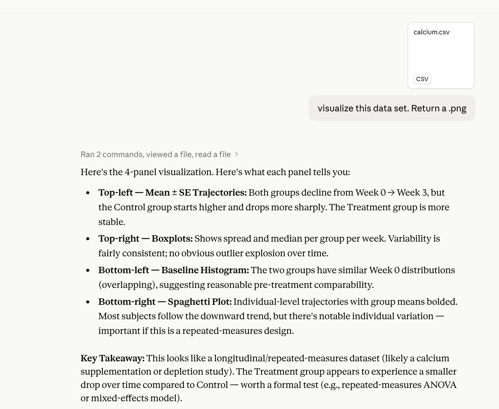
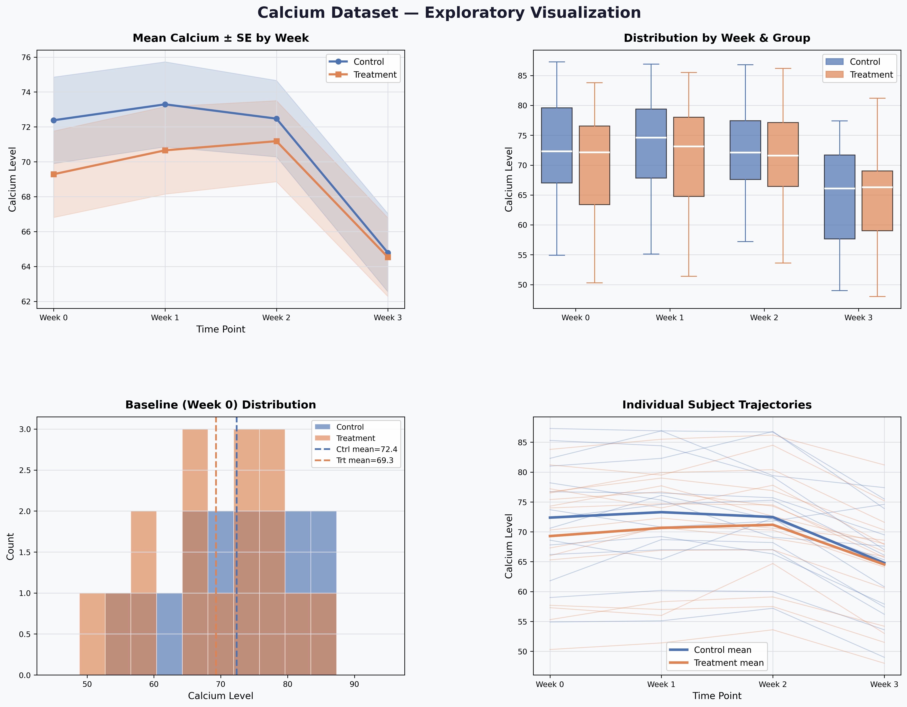
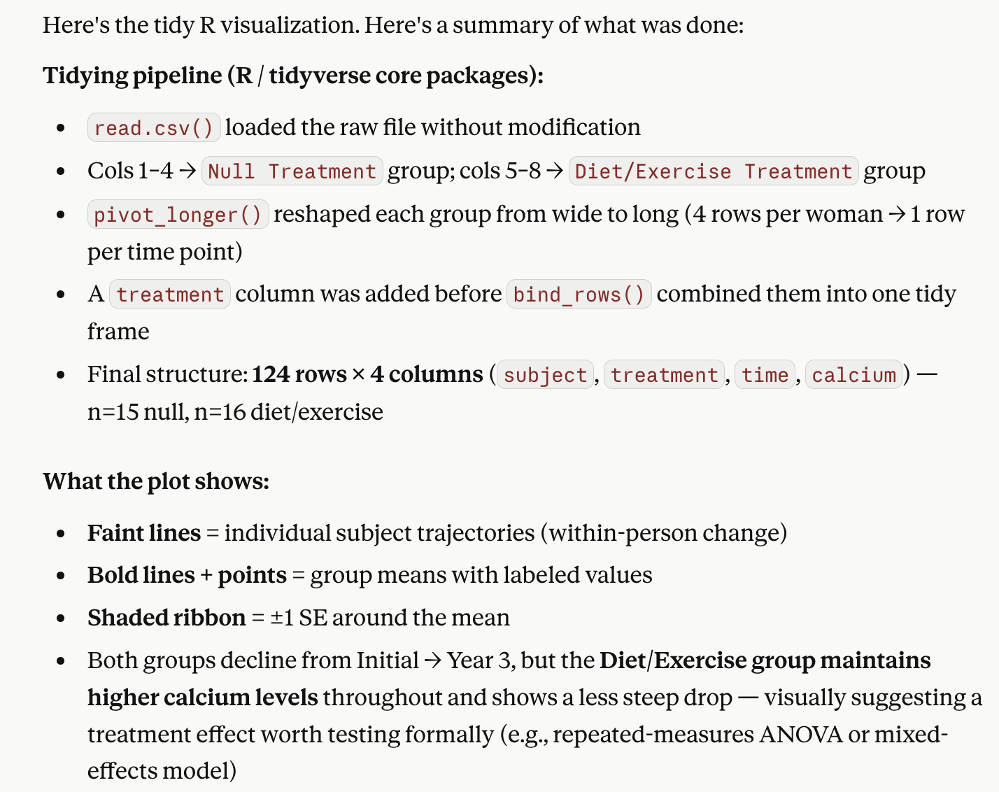
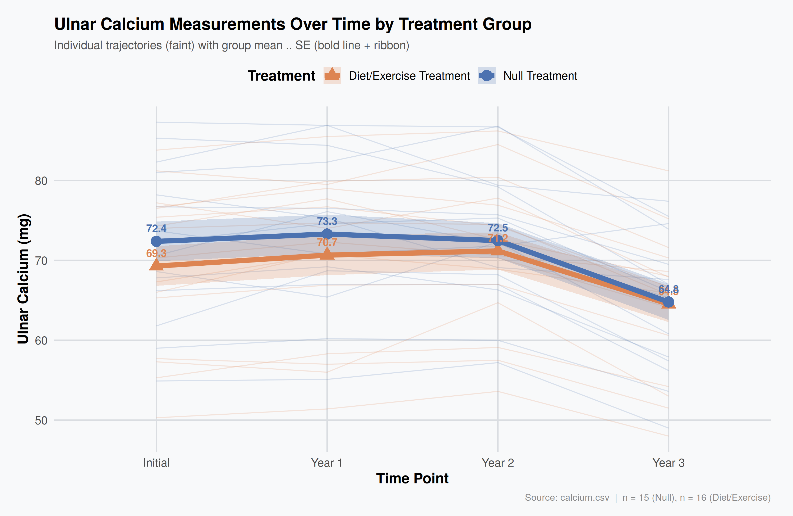

# Busiest Airports

## Overview

Passenger traffic across all six airports followed a near-identical recovery arc. There was a sharp drop in 2020 because of COVID-19 (see @fig-airportPlot). Then they each saw aggressive rebounds through 2021–2022, then a plateau approaching pre and post-pandemic ceilings by 2023–2025. Atlanta (ATL) stands apart from every other airport in both scale and resilience. Atlanta's airport never dipped below 42M even at the pandemic floor and climbed to 108M by 2024, a volume roughly 35–50M passengers higher than its nearest competitors CDG and FRA in any given year. Charles de Gaulle (CDG) and Frankfurt (FRA) tell a different story. Both airports collapsed to under 25M in 2020–2021 due to stricter international travel restrictions, then rebounded steeply, with CDG ultimately pulling ahead of FRA and settling near 72M by 2025. The domestic-heavy US airports, MCO and SEA, recovered faster in 2021 because they rely more on domestic leisure and regional travel, which reopened earlier than transatlantic routes (see @tbl-airports).

Beijing Daxing (PKX) is the most structurally interesting case in the data set. The data gaps in 2020, 2022, and 2024 reflect China's extended zero-COVID border closures rather than low traffic, and the available figures (25M in 2021, 49M in 2023, 54M in 2025) suggest a steep underlying growth trajectory consistent with a relatively new airport still scaling operations (see @tbl-airports). Taken together, the table and plot reveal that airport recovery speed was less about airport size and more about the domestic/international traffic mix and national policy. US airports recovered volume fastest, European airports recovered latest but steadily, and PKX's interrupted data is itself the story of a policy regime rather than a traffic trend.

```{r}
#| label: airportWrangling
#| echo: false
# Load Packages 
# install.packages("tidyverse")
# install.packages("rvest")
# install.packages("knitr")
# install.packages("kableExtra")
library(tidyverse)
library(rvest)
library(knitr)
library(kableExtra)

# Web Scrape Airport Data from Wikipedia 
## Pulls all HTML tables from the busiest airports Wikipedia page
ap_data_raw <- read_html(
  x = "https://en.wikipedia.org/wiki/List_of_busiest_airports_by_passenger_traffic"
) |>
  html_elements(css = "table") |>
  html_table()

# Extract Individual Year Tables and Add Year Column 
## Each year occupies a different table index on the Wikipedia page
airports_2025 <- ap_data_raw[[2]] |>
  mutate(
    year = 2025,
    .before = Rank
  )

airports_2024 <- ap_data_raw[[3]] |>
  mutate(
    year = 2024,
    .before = Rank
  )

airports_2023 <- ap_data_raw[[4]] |>
  mutate(
    year = 2023,
    .before = Rank
  )

airports_2022 <- ap_data_raw[[5]] |>
  mutate(
    year = 2022,
    .before = Rank
  )

airports_2021 <- ap_data_raw[[6]] |>
  mutate(
    year = 2021,
    .before = Rank
  )

airports_2020 <- ap_data_raw[[7]] |>
  mutate(
    year = 2020,
    .before = Rank
  )

# Define Chosen Airports 

airports_chosen <- c("ATL","FRA","PKX","MCO","SEA","CDG")

# Combine, Clean, and Filter to Target Airports 
airport_target_yearrange <- bind_rows(
  airports_2020,
  airports_2021,
  airports_2022,
  airports_2023,
  airports_2024,
  airports_2025
) |>
  rename(
    passengers = Totalpassengers,
    percentChange = '%change'
  ) |>
  separate_wider_delim(
    cols = 'Code(IATA/ICAO)',
    delim = "/",
    names = c("IATA", "ICAO"),
    too_few = "align_start",
    too_many = "merge"
  ) |>
  filter(IATA %in% airports_chosen) |>
  mutate(
    across(
      .cols = c(passengers, percentChange),
      .fns = ~parse_number(.x)
    )
  )
```



## Busiest Airport Table

```{r}
#| label: tbl-airports
#| tbl-cap: "Passenger Flow for Six of The Top 50 Busiest Airports in the World (In millions)"
#| tbl-pos: H
#| html-table-processing: none
#| echo: false

# Clean Up Environment
## Remove intermediate objects no longer needed
remove(list = c("airports_2020","airports_2021","airports_2022","airports_2023", "airports_2024", "airports_2025","ap_data_raw")
)

airport_target_yearrange_wide_table <- airport_target_yearrange |>
  mutate(
    passengers_mil = round(passengers/1000000,digits = 2)
  ) |>
  dplyr::select(year, Airport, IATA, passengers_mil) |>
  # Pivot to Wide Format for Table Display
  pivot_wider(
    names_from = year,
    values_from = passengers_mil
  )
# Render Polished Table
airport_target_yearrange_wide_table |>
  kable(
    ## Comma formatting, alignment, footnote for missing data
    align = "lccccccc",
    format.args = list(big.mark = ",")
  ) |>
  kable_classic() |>
  column_spec(1:8, border_left = TRUE, border_right = TRUE) |>
  kable_styling(latex_options = c("scale_down", "hold_position"), font_size = 10) |>
  footnote(
    general = "Airports that were not in the top 50 have missing passenger data; highlighted rows are the three required airports.",
    footnote_as_chunk = TRUE
  )
```

## Busiest Airport Plot

```{r}
#| label: fig-airportPlot
#| fig-cap: "Six of Top 50 Busiest Passenger Airports"
#| fig-pos: H
#| fig-height: 5
#| fig-alt: "A line chart titled 'Six of Top 50 Busiest Passenger Airports' showing annual passenger traffic in millions for six major airports (ATL, CDG, FRA, MCO, SEA, PKX) from 2020 to 2025, with ATL consistently leading above 75M passengers."
#| aria-describedby: namesPlotLD
#| lst-label: lst-figure1
#| lst-cap: "Airport plot code chunk"
#| echo: false
# Set Color Palette
psuPalette <- c("#001E44", "#1E407C", "#000000", "#96BEE6","#999999","#FF10F0")

airport_target_yearrange |>
  mutate(
    # Express Passengers in Millions for Readability
    passengers_mil = passengers /1000000
  ) |>
  # Build Line Plot
  ggplot(
    ## Framework
    mapping = aes(x = year, y = passengers_mil, group = IATA, color = IATA, linetype = IATA)
    ) +
      ## Geometry
      geom_line(na.rm = TRUE) +          
      geom_point(na.rm = TRUE, size = 2.5) +
      ## Scales
      scale_x_continuous(expand = c(0, 0.15)) + 
      scale_y_continuous(
        labels = scales::label_number(suffix = "M"),
        breaks = seq(0, 120, by = 10)) + 
            ## Labels
            labs(x = "Year", 
                 y = "Passenger Traffic Flow (millions)", 
                 color = "Airport",
                 linetype = "Airport") +
            ## Theme
            scale_color_manual(values = psuPalette) +
            theme_bw() +
            theme(
              legend.position = "bottom",
              legend.key.width = unit(2, "cm"),
              legend.key.height = unit(0.25, "cm")
            )

```



# Monte Carlo Numerical Integration

## Overview

This small multiple demonstrates how increasing the number of simulated points improves the accuracy of Monte Carlo numerical integration. The colors of the "on/below" and "above" the bell curve lose their distinctions as the sample size increases which also merged the shapes of the points. As shown in @fig-mcSmallMultiple, n=10 the estimate of 0.96 is a rough approximation with the generated points being spaced out and shows a lack stability. The final estimation at n=10000 shows a stabilized outcome of 1.0291, which suggests that the true integral of the standard normal PDF over \[-4, 4\] is approximately 1.0. This makes intuitive sense because the standard normal distribution is defined such that its total area under the curve equals 1, and our bounds of -4 to 4 capture nearly all of that area.

## Small Multiple Visualization

```{r}
#| label: mc_sim_function
#| echo: false

#' Monte Carlo Simulation of Points
#'
#' @description
#' Create a specific number of randomly selected points in a range of given x and y bounds for 
#' Monte Carlo integration.
#'
#' @param xbounds num A numeric vector of the lower and upper bounds for x
#' @param ybounds num A numeric vector of the lower and upper bounds for y
#' @param n num The number of points generated
#'
#' @returns A data frame of randomly generated ordered pairs.
#'
#' @details
#' This function will create a data frame of `n` randomly generated points. The
#' points will have x-coordinates uniformly sampled from `xbounds`, inclusive,
#' while the y-coordinates will be uniformly from `ybounds`.

library(tidyverse) # For wrangling and plotting

mc_sim <- function(xbounds, ybounds, n){
  # Generate uniform random points within the specified bounds
  randPoints <- data.frame(
    x = runif(n = n, min = xbounds[1], max = xbounds[2]),
    y = runif(n = n, min = ybounds[1], max = ybounds[2])
  )

  return(randPoints)
}
```

```{r}
#| label: mcWrangling
#| echo: false

# Generate 10000 Random Points Within Bounds
## Master set for all four plots
set.seed(184) 
setpoints <- mc_sim(
  xbounds = c(-4, 4),
  ybounds = c(0, 0.4),
  n = 10000
)

# Flag Points and Calculate Running Area Estimate
## Compare each point's y value against dnorm to determine above/below
## Running proportion and area estimate used for plot captions
mcpoints <- setpoints |>
  mutate(
    # Flag whether point is above or below the curve
    flag = case_when(
      y > dnorm(x, mean = 0, sd = 1) ~ 'above',
      .default = "on/below"
    ),
    # Convert flag to numeric for running calculation
    numFlag = case_when(
      y > dnorm(x, mean = 0, sd = 1) ~ 0,
      .default = 1
    ),
    case = row_number(),
    prop = cumsum(numFlag)/case,
    # Estimated area = proportion below curve * box width * box height
    numInt = prop * (4 - (-4)) * (0.4 - 0)
  )

```

```{r}
#| label: mc_plot_fig10
#| fig-cap: "Monte Carlo Integration, n = 10"
#| fig-pos: H
#| fig-height: 4
#| fig-alt: "Scatter plot of 10 random points inside a box bounded by x = -4 to 4 and y = 0 to 0.4, with points colored by whether they fall above or below the standard normal curve."
#| echo: false
# Set Color Palette
mcpalette <- c("#A200FF","#96BEE6")


mc_figure10 <- mcpoints |>
  slice_head(n = 10) |>
  ggplot(mapping = aes(x = x, y = y,color = flag,shape = flag)) +
    stat_function(
    fun = dnorm,
    args = list(mean = 0, sd = 1),
    xlim = c(-4, 4),
    color = "black",
    inherit.aes = FALSE) +
    geom_point() +
      scale_x_continuous(limits = c(-4,4), expand = expansion()) +
      scale_y_continuous(limits = c(0,0.4), expand = expansion()) +
      scale_color_manual(values = mcpalette) +
      labs(subtitle = paste(
      "Est. Integral:",
      round(mcpoints$numInt[10], digits = 4)
    ),
    x = "X",
    y = "Y",
    color = "Flag",
    shape = "Flag") +
  theme_bw() +
  theme(legend.position = "none")

```

```{r}
#| label: mc_plot_fig100
#| fig-cap: "Monte Carlo Integration, n = 100"
#| fig-pos: H
#| fig-height: 4
#| fig-alt: "Scatter plot of 100 random points inside a box bounded by x = -4 to 4 and y = 0 to 0.4, with points colored by whether they fall above or below the standard normal curve."
#| echo: false
# Set Color Palette
mcpalette <- c("#A200FF","#96BEE6")


mc_figure100 <- mcpoints |>
  slice_head(n = 100) |>
  ggplot(mapping = aes(x = x, y = y,color = flag,shape = flag)) +
    stat_function(
    fun = dnorm,
    args = list(mean = 0, sd = 1),
    xlim = c(-4, 4),
    color = "black",
    inherit.aes = FALSE) +
    geom_point() +
      scale_x_continuous(limits = c(-4,4), expand = expansion()) +
      scale_y_continuous(limits = c(0,0.4), expand = expansion()) +
      scale_color_manual(values = mcpalette) +
      labs(subtitle = paste(
      "Est. Integral:",
      round(mcpoints$numInt[100], digits = 4)
    ),
    x = "X",
    y = "Y",
    color = "Flag",
    shape = "Flag") +
  theme_bw() +
  theme(legend.position = "none")

```

```{r}
#| label: mc_plot_fig1000
#| fig-cap: "Monte Carlo Integration, n = 1000"
#| fig-pos: H
#| fig-height: 4
#| fig-alt: "Scatter plot of 1000 random points inside a box bounded by x = -4 to 4 and y = 0 to 0.4, with points colored by whether they fall above or below the standard normal curve."
#| echo: false
# Set Color Palette
mcpalette <- c("#A200FF","#96BEE6")


mc_figure1000 <- mcpoints |>
  slice_head(n = 1000) |>
  ggplot(mapping = aes(x = x, y = y,color = flag,shape = flag)) +
    stat_function(
    fun = dnorm,
    args = list(mean = 0, sd = 1),
    xlim = c(-4, 4),
    color = "black",
    inherit.aes = FALSE) +
    geom_point() +
      scale_x_continuous(limits = c(-4,4), expand = expansion()) +
      scale_y_continuous(limits = c(0,0.4), expand = expansion()) +
      scale_color_manual(values = mcpalette) +
      labs(subtitle = paste(
      "Est. Integral:",
      round(mcpoints$numInt[1000], digits = 4)
    ),
    x = "X",
    y = "Y",
    color = "Flag",
    shape = "Flag") +
  theme_bw() +
  theme(legend.position = "none")

```

```{r}
#| label: mc_plot_fig10000
#| fig-cap: "Monte Carlo Integration, n = 10000"
#| fig-pos: H
#| fig-height: 4
#| fig-alt: "Scatter plot of 10000 random points inside a box bounded by x = -4 to 4 and y = 0 to 0.4, with points colored by whether they fall above or below the standard normal curve."
#| echo: false
# Set Color Palette
mcpalette <- c("#A200FF","#96BEE6")


mc_figure10000 <- mcpoints |>
  slice_head(n = 10000) |>
  ggplot(mapping = aes(x = x, y = y,color = flag,shape = flag)) +
    stat_function(
    fun = dnorm,
    args = list(mean = 0, sd = 1),
    xlim = c(-4, 4),
    color = "black",
    inherit.aes = FALSE) +
    geom_point() +
      scale_x_continuous(limits = c(-4,4), expand = expansion()) +
      scale_y_continuous(limits = c(0,0.4), expand = expansion()) +
      scale_color_manual(values = mcpalette) +
      labs(subtitle = paste(
      "Est. Integral:",
      round(mcpoints$numInt[10000], digits = 4)
    ),
    x = "X",
    y = "Y",
    color = "Flag",
    shape = "Flag") +
  theme_bw() +
  theme(legend.position = "none")

```

```{r}
#| label: fig-mcSmallMultiple
#| fig-cap: "Monte Carlo Numerical Integration at Four Resolutions"
#| fig-subcap:
#|   - "n = 10"
#|   - "n = 100"
#|   - "n = 1000"
#|   - "n = 10000"
#| layout-ncol: 2
#| echo: false


print(mc_figure10)
print(mc_figure100)
print(mc_figure1000)
print(mc_figure10000)
```



# Planning and Prompting GenAI Tools

## Generic Response

### STAT184 Generic Response Visuals

```{r}
#| label: fig-genericResponse1
#| fig-cap: "Generic Prompt Response — Group Means View"
#| fig-pos: H
#| echo: false
knitr::include_graphics("ClaudePlot1.png")
```

```{r}
#| label: fig-genericResponse2
#| fig-cap: "Generic Prompt — Individual Lines View"
#| fig-pos: H
#| echo: false
knitr::include_graphics("ClaudePlot2.png")
```



### My Generic Prompt and Response

{fig-align="center"}

{fig-align="center"}



## Plan-Informed Response

::: {.callout-note appearance="simple"}
## My Plan

### Goal

Tidy the calcium data set and create a visualization that allows comparison of ulnar calcium measurements across time and between the null treatment and diet/exercise treatment groups.

### Needs

-   calcium.csv loaded into R without modification

-   tidyverse for tidying and plotting

-   The data reshaped from wide to long format where each row represents one woman at one time point

-   A group identifier column distinguishing null treatment (columns 1–4) from diet/exercise treatment (columns 5–8)

-   A time variable representing Initial, Year 1, Year 2, and Year 3

### Steps

-   Load calcium.csv and inspect structure

-   Separate the eight columns into two groups by treatment

-   Pivot each group to long format adding a time column

-   Add a treatment label column to each then combine into one tidy data frame

-   Verify the tidy structure — each row should be one woman at one time point

-   Create a line plot showing calcium measurement over time grouped by treatment
:::



### Claude's Response

{fig-align="center"}

{fig-align="center"}

### Generic vs Planned Comparison

The plan-informed prompt produced structured, context-aware R code that correctly identified the untidy structure of the calcium data, separated the two treatment groups by column position, and pivoted each to long format before combining. The generic prompt produced an interactive visualization without any wrangling code, treating the data as though it were already tidy. The plan informed response is more reproducible and analytically rigorous, while the generic response prioritized visual appeal over data integrity. This demonstrates that prompt specificity directly determines the utility of genAI output for data analysis tasks.



# Self-Reflection

Throughout this semester I have learned that I am not a big fan of R as a language. I can see its usefulness for statistics and visualization. I enjoyed doing the Airport wrangling, table making, and plotting because I thought the topic was more interesting compared to the other assignments. I have done a lot traveling and use flight logging apps like Flighty so it was fun to code for that. I originally hardcoded the data for the HW3.4 because I was more comfortable with that but for this assignment I used web scraping. I was able to build comfortability with web scraping and how to debug certain errors like the data improperly importing. In terms of the class, it was hard adapting to a template workflow style of the class as I prefer to be more open about my approach to problem solving. It is harder for me personally to solve a complex problem when I am given a specific way to approach. Overall, I don't believe I did as well in this class as I could have but I also believe that my learning style differs from the courses teaching style.



# Appendix A: GenAI Usage

**Tool:** Claude Sonnet 4.6

**Date:** April 14, 2026

**Prompt:** "visualize this data set. Return a .png"

**Response:** "

Here's the 4-panel visualization. Here's what each panel tells you:

Top-left — Mean ± SE Trajectories: Both groups decline from Week 0 → Week 3, but the Control group starts higher and drops more sharply. The Treatment group is more stable. Top-right — Boxplots: Shows spread and median per group per week. Variability is fairly consistent; no obvious outlier explosion over time. Bottom-left — Baseline Histogram: The two groups have similar Week 0 distributions (overlapping), suggesting reasonable pre-treatment comparability. Bottom-right — Spaghetti Plot: Individual-level trajectories with group means bolded. Most subjects follow the downward trend, but there's notable individual variation — important if this is a repeated-measures design.

Key Takeaway: This looks like a longitudinal/repeated-measures dataset (likely a calcium supplementation or depletion study). The Treatment group appears to experience a smaller drop over time compared to Control — worth a formal test (e.g., repeated-measures ANOVA or mixed-effects model)."

Prompt: "

Goal

Tidy the calcium data set and create a visualization that allows comparison of ulnar calcium measurements across time and between the null treatment and diet/exercise treatment groups.

Needs

-   calcium.csv loaded into R without modification

-   tidyverse for tidying and plotting

-   The data reshaped from wide to long format where each row represents one woman at one time point

-   A group identifier column distinguishing null treatment (columns 1–4) from diet/exercise treatment (columns 5–8)

-   A time variable representing Initial, Year 1, Year 2, and Year 3

    Steps

-   Load calcium.csv and inspect structure

-   Separate the eight columns into two groups by treatment

-   Pivot each group to long format adding a time column

-   Add a treatment label column to each then combine into one tidy data frame

-   Verify the tidy structure — each row should be one woman at one time point

-   Create a line plot showing calcium measurement over time grouped by treatment"

Now using this plan make a new visualization in .png format. Do not try to host R environment. You are not able to. If you attempt to do so that means you need do a hard stop."\
\
Response: "

Here's the tidy R visualization. Here's a summary of what was done: Tidying pipeline (R / tidyverse core packages):

read.csv() loaded the raw file without modification Cols 1–4 → Null Treatment group; cols 5–8 → Diet/Exercise Treatment group pivot_longer() reshaped each group from wide to long (4 rows per woman → 1 row per time point) A treatment column was added before bind_rows() combined them into one tidy frame Final structure: 124 rows × 4 columns (subject, treatment, time, calcium) — n=15 null, n=16 diet/exercise

What the plot shows:

Faint lines = individual subject trajectories (within-person change) Bold lines + points = group means with labeled values Shaded ribbon = ±1 SE around the mean Both groups decline from Initial → Year 3, but the Diet/Exercise group maintains higher calcium levels throughout and shows a less steep drop — visually suggesting a treatment effect worth testing formally (e.g., repeated-measures ANOVA or mixed-effects model)"



# **Code Appendix**

```{r}
#| label: codeAppend
#| ref-label: !expr knitr::all_labels()
#| echo: true
#| eval: false
```
