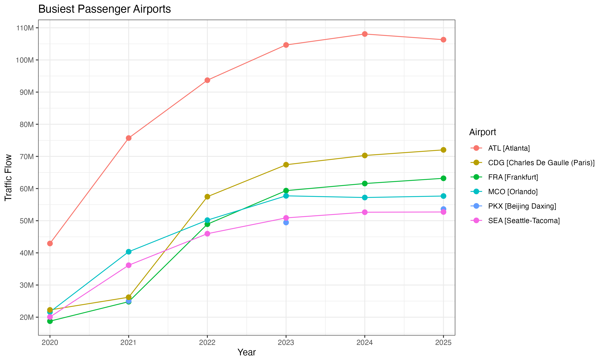

# HW 4.3 Reproducible Data Analysis

A reproducible data analysis of airport passenger traffic and 
Monte Carlo numerical integration, built with Quarto and RStudio.

## Overview

This repo contains the deliverables for STAT 184 HW 4.3. The 
analysis covers passenger traffic trends across six major 
international airports from 2020–2025, a Monte Carlo simulation 
for numerical integration under the standard normal curve, and 
an exploration of how plan-informed GenAI prompting compares to 
generic prompting for data tidying tasks.

## Interesting Insight

Atlanta's airport (ATL) never dropped below 42M passengers even 
at the pandemic floor in 2020, while European airports like CDG 
and FRA collapsed to under 25M. The plot below shows the full 
recovery arc across all six airports.

## Data Sources and Acknowledgements

- Airport passenger data: Wikipedia — List of Busiest Airports 
  by Passenger Traffic (scraped via `rvest`)
- Monte Carlo simulation: generated in R using `dnorm()`
- Calcium dataset: provided by course instructor (STAT 184, PSU)
- GenAI tool used: Claude Sonnet 4.6 (Anthropic)

## Current Plan

See `PLAN.md` for the full Goals, Needs, and Steps for both the 
project analysis and the repo setup and maintenance plan.

## Repo Structure

├── HW4.3_ReproducibleAnalysis.qmd   # Source Quarto document
├── HW4.3_ReproducibleAnalysis.pdf   # Rendered PDF output
├── ClaudePlot1.png                  # Generic prompt plot 1
├── ClaudePlot2.png                  # Generic prompt plot 2
├── images/                          # Supporting images for QMD
├── PLAN.md                          # Project and repo plan
├── README.md                        # This file
└── HW4.4_Template.Rproj             # RStudio project file

## Authors

Akil Creswell — Penn State University, STAT 184
